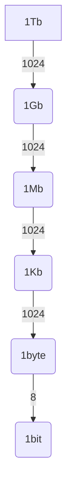
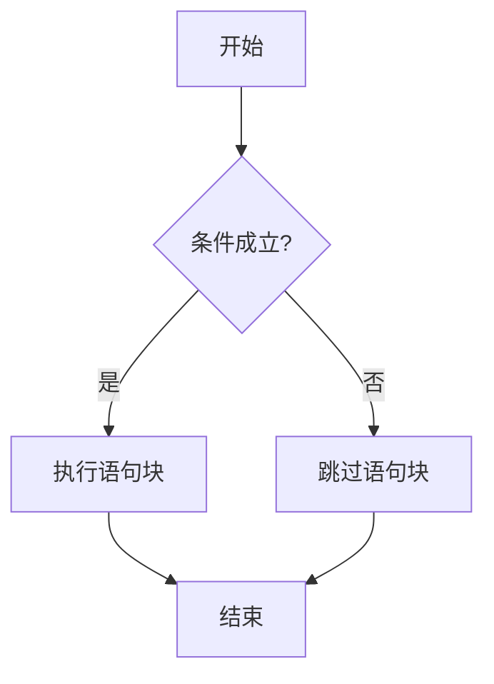
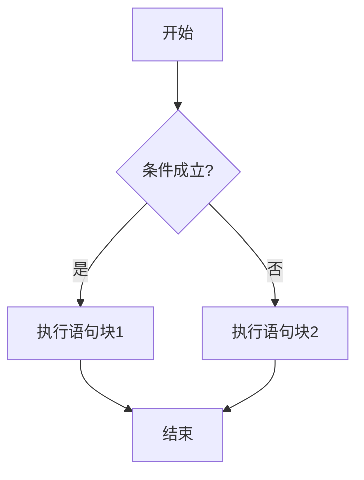
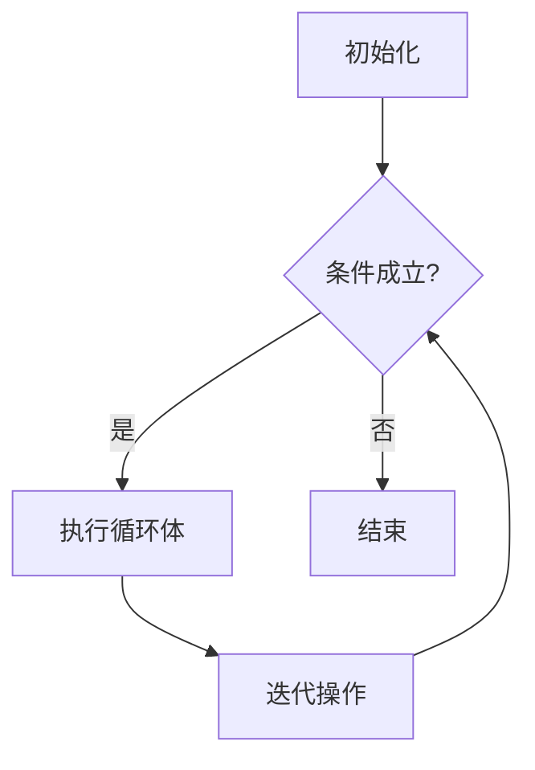
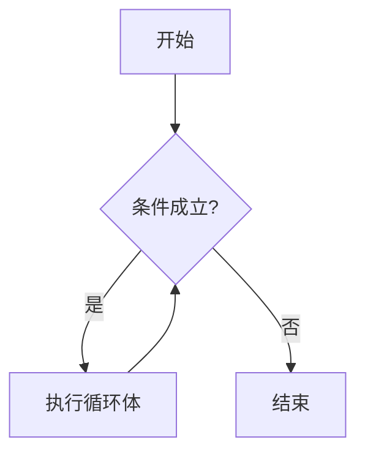
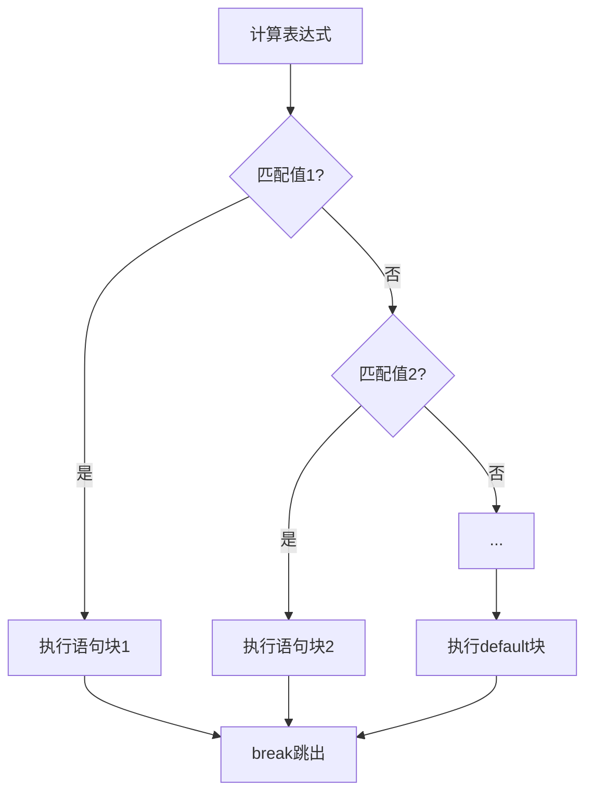
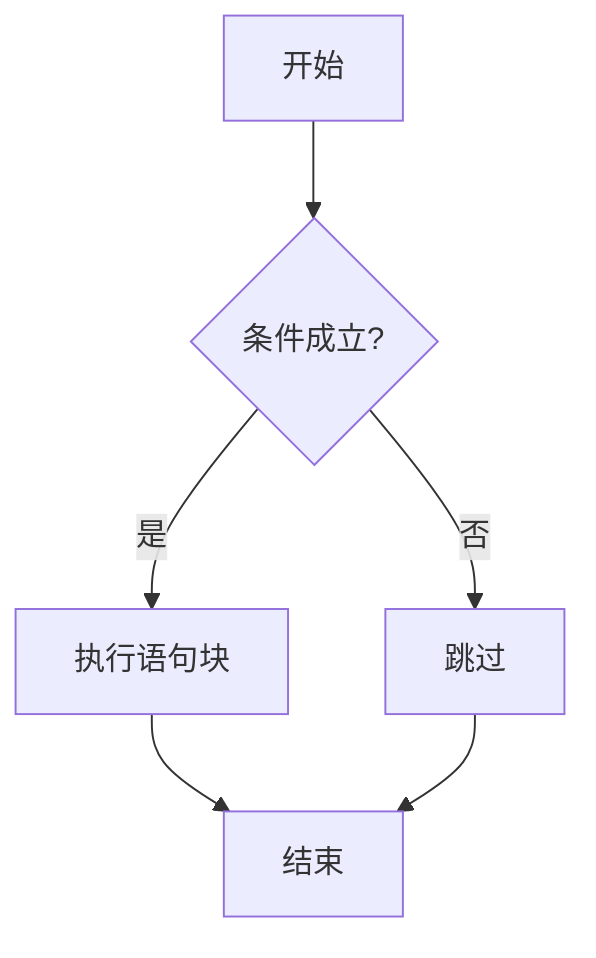
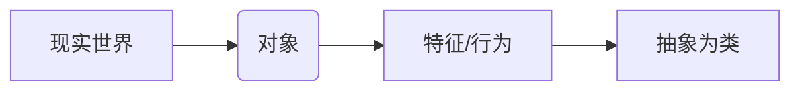
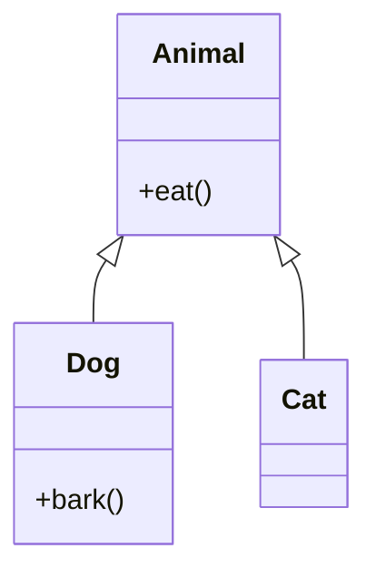

# Java编程基础与程序设计


## 一、计算机基础与Java概述

### 1. 计算机体系结构

#### 基本概念
- 计算机俗称"电脑"，由**计算机硬件**和**计算机软件**组成
- **标准输入设备**：键盘
- **标准输出设备**：显示器

#### 核心硬件详解
| 硬件   | 功能描述                  | 关键特性                  | 使用注意                |
|--------|---------------------------|--------------------------|-------------------------|
| CPU    | 处理指令和数据            | 计算机核心，类比人脑      | 不同型号性能差异大      |
| 内存   | 临时存储CPU访问的数据      | 高速读写，断电数据丢失    | 重要数据需`Ctrl+S`保存  |
| 硬盘   | 永久存储数据              | 容量大，速度较慢          | 分为机械硬盘和固态硬盘  |
| 显卡   | 图形处理                  | 影响显示效果              | 游戏/设计需要高性能显卡 |

#### 存储单位完整换算

> 📌 **特别说明**：
> - 1个英文字母=1字节，1个汉字=2字节
> - 硬件厂商用1000进制，操作系统用1024进制

---

## 二、Java开发环境配置

### 1. JDK安装与配置

#### 下载方式
1. 官网下载：[Oracle官网](http://www.oracle.com)
2. 搜索引擎下载：[百度](http://www.baidu.com)或[搜狗](http://www.sogou.com)

#### 安装类型
| 安装类型 | 操作步骤               | 注意事项           |
| -------- | ---------------------- | ------------------ |
| 绿色版   | 直接解压               | 解压路径不要含中文 |
| 安装版   | 双击安装包，一直下一步 | 建议默认安装路径   |

#### 核心组件
| 组件 | 全称           | 包含工具    | 作用说明               |
| ---- | -------------- | ----------- | ---------------------- |
| JDK  | Java开发工具包 | javac.exe等 | 开发Java程序必需       |
| JRE  | Java运行时环境 | java.exe等  | 运行Java程序必需       |
| JVM  | Java虚拟机     | 内置        | 实现"一次编写到处运行" |

### 2. 环境变量配置（完整步骤）

1. **打开配置界面**：
   - 计算机 → 右键 → 属性 → 高级系统设置 → 高级 → 环境变量

2. **配置Path变量**：
   ```diff
   # 修改前：
   Path = 原有内容
   # 修改后：
   Path = JDK安装路径\bin;原有内容
   ```

3. **验证配置**：
   ```cmd
   :: 在CMD中执行
   javac -version
   java -version
   ```

> ⚠️ **重要提醒**：
> - 路径中不要使用中文
> - 配置后需重启CMD窗口
> - 不要删除Path原有内容

---

## 三、Java编程基础

### 1. 完整编程流程

#### 详细步骤
1. **创建源文件**：
   - 新建`xxx.txt` → 重命名为`xxx.java`
   - 显示扩展名方法：
     ```plaintext
     组织 → 文件夹选项 → 查看 → 取消"隐藏已知文件类型扩展名"
     ```

2. **编写代码**：
   ```java
   // 示例代码
   public class Hello {
       public static void main(String[] args) {
           System.out.println("你好Java！");
       }
   }
   ```

3. **编译运行**：
   ```cmd
   javac Hello.java  # 编译
   java Hello       # 运行·
   ```

### 2. 变量与注释

#### 变量声明规范
```java
// 标准格式
数据类型 变量名 = 初始值;
// 示例：
int age = 18;
```

#### 标识符命名规则
| 规则类型   | 合法示例           | 非法示例       |
| ---------- | ------------------ | -------------- |
| 组成字符   | name, _age, $value | 123name        |
| 关键字限制 | userName           | public         |
| 大小写敏感 | Name ≠ name        |                |
| 长度无限制 | studentAge         | 超长名称不推荐 |

#### 注释类型对比
| 注释类型 | 语法     | 特点            | 示例              |
| -------- | -------- | --------------- | ----------------- |
| 单行注释 | //       | 从//到行尾      | `// 这是单行注释` |
| 多行注释 | /*...*/  | 不可嵌套        | 见下方代码块      |
| 文档注释 | /**...*/ | 支持Javadoc标签 | 见下方代码块      |

```java
/*
 * 这是多行注释
 * 可以跨越多行
 */

/**
 * 文档注释示例
 * @param args 命令行参数
 */
```

---

## 四、数据类型与进制

### 1. 数据类型完整分类

#### 基本数据类型
| 类型   | 关键字  | 大小  | 取值范围     | 默认值   |
| ------ | ------- | ----- | ------------ | -------- |
| 字节型 | byte    | 1字节 | -128~127     | 0        |
| 短整型 | short   | 2字节 | -32768~32767 | 0        |
| 整型   | int     | 4字节 | -2³¹~2³¹-1   | 0        |
| 长整型 | long    | 8字节 | -2⁶³~2⁶³-1   | 0L       |
| 单精度 | float   | 4字节 | IEEE754标准  | 0.0f     |
| 双精度 | double  | 8字节 | IEEE754标准  | 0.0d     |
| 布尔型 | boolean | 1位   | true/false   | false    |
| 字符型 | char    | 2字节 | Unicode字符  | '\u0000' |

#### 引用数据类型
- 数组、类、接口、枚举、注解

### 2. 进制转换（完整方法）

#### 正十进制转二进制
**方法一：除2取余法**
```
45 ÷ 2 = 22 余 1 ↑
22 ÷ 2 = 11 余 0 ↑
11 ÷ 2 = 5  余 1 ↑
5  ÷ 2 = 2  余 1 ↑
2  ÷ 2 = 1  余 0 ↑
1  ÷ 2 = 0  余 1 ↑
结果：101101
```

**方法二：拆分法**

```
45 = 32 + 8 + 4 + 1
权重位置：
128 64 32 16 8 4 2 1
  0  0  1  0 1 1 0 1
结果：00101101
```

#### 负数十进制转二进制
```
-45 转换步骤：
1. 取绝对值：45 → 00101101
2. 按位取反：11010010
3. 加1：     11010011
最终结果：11010011
```

#### 二进制转十进制
```math
00101101 = 0×2⁷ + 0×2⁶ + 1×2⁵ + 0×2⁴ + 1×2³ + 1×2² + 0×2¹ + 1×2⁰
         = 0 + 0 + 32 + 0 + 8 + 4 + 0 + 1
         = 45
```

---
# 五.Java运算符

## 1. 算术运算符

### 基本运算符
| 运算符 | 名称       | 示例      | 说明                 |
|--------|------------|-----------|----------------------|
| `+`    | 加法       | `a + b`   | 两数相加             |
| `-`    | 减法       | `a - b`   | 两数相减             |
| `*`    | 乘法       | `a * b`   | 两数相乘             |
| `/`    | 除法       | `a / b`   | 两数相除             |
| `%`    | 取模       | `a % b`   | 返回除法余数         |

### 注意事项
```java
int a = 5;
int b = 2;

// 整数除法
System.out.println(a / b);  // 输出：2（小数部分丢失）

// 保留小数的方法
System.out.println((double)a / b);    // 方法1：强制类型转换
System.out.println(a * 1.0 / b);      // 方法2：推荐方式（乘以1.0）

// 除数为0的情况
System.out.println(a / 0);     // 抛出ArithmeticException
System.out.println(a / 0.0);   // 输出：Infinity

// 字符串连接
System.out.println("结果：" + a + b);   // 输出："结果：52"
System.out.println(a + b + "是结果");  // 输出："7是结果"
```

---

## 2. 关系运算符

### 比较运算符
| 运算符 | 名称     | 示例     | 结果    |
| ------ | -------- | -------- | ------- |
| `>`    | 大于     | `a > b`  | boolean |
| `<`    | 小于     | `a < b`  | boolean |
| `==`   | 等于     | `a == b` | boolean |
| `>=`   | 大于等于 | `a >= b` | boolean |
| `<=`   | 小于等于 | `a <= b` | boolean |
| `!=`   | 不等于   | `a != b` | boolean |

### 示例代码
```java
int x = 10;
int y = 20;

System.out.println(x > y);   // false
System.out.println(x == 10); // true
System.out.println(y != 20); // false
```

---

## 3. 自增/自减运算符

### 运算符对比
| 运算符 | 名称   | 示例  | 等价表达式  |
| ------ | ------ | ----- | ----------- |
| `++i`  | 前自增 | `++a` | `a = a + 1` |
| `i++`  | 后自增 | `a++` | `a = a + 1` |
| `--i`  | 前自减 | `--a` | `a = a - 1` |
| `i--`  | 后自减 | `a--` | `a = a - 1` |

### 关键区别
```java
int a = 5;
int b = a++;  // b=5, a=6（先赋值后自增）
int c = ++a;  // c=7, a=7（先自增后赋值）
```

---

## 4. 逻辑运算符

### 基本逻辑运算
| 运算符 | 名称 | 示例     | 说明                     |
| ------ | ---- | -------- | ------------------------ |
| `&&`   | 与   | `a && b` | 两个条件都为真时返回true |
| `||`   | 或   | `a || b` | 任一条件为真时返回true   |
| `!`    | 非   | `!a`     | 条件取反                 |

### 短路特性示例
```java
int i = 5;
// 第二个条件不会执行（短路）
boolean result = (i < 0) && (++i > 0); 
System.out.println(i);  // 输出：5
```

---

## 5. 条件（三目）运算符

### 语法结构
```java
条件 ? 表达式1 : 表达式2
```

### 使用示例
```java
int score = 85;
String result = score >= 60 ? "及格" : "不及格";
System.out.println(result);  // 输出："及格"
```

---

## 6. 赋值运算符

### 赋值类型
| 运算符 | 示例     | 等价形式    |
| ------ | -------- | ----------- |
| `=`    | `a = 5`  | -           |
| `+=`   | `a += 3` | `a = a + 3` |
| `-=`   | `a -= 2` | `a = a - 2` |
| `*=`   | `a *= 4` | `a = a * 4` |
| `/=`   | `a /= 2` | `a = a / 2` |
| `%=`   | `a %= 3` | `a = a % 3` |

### 优先级说明
```java
int a = 10;
a *= 2 + 3;  // 等价于 a = a * (2 + 3) = 50
```

---

## 7. 位运算符

### 移位运算符
| 运算符 | 名称       | 示例      | 说明                       |
| ------ | ---------- | --------- | -------------------------- |
| `<<`   | 左移       | `a << 2`  | 二进制位左移，低位补0      |
| `>>`   | 右移       | `a >> 1`  | 二进制位右移，高位补符号位 |
| `>>>`  | 无符号右移 | `a >>> 3` | 二进制位右移，高位补0      |

### 位运算
| 运算符 | 名称     | 示例    | 说明           |
| ------ | -------- | ------- | -------------- |
| `&`    | 按位与   | `a & b` | 对应位都为1则1 |
| `|`    | 按位或   | `a | b` | 对应位有1则1   |
| `^`    | 按位异或 | `a ^ b` | 对应位不同则1  |
| `~`    | 按位取反 | `~a`    | 0变1，1变0     |

### 示例代码
```java
int num = 60;  // 二进制：00111100
System.out.println(num << 2);  // 240（11110000）
System.out.println(num & 15);  // 12（00001100）
```

---

## 运算符优先级表
| 优先级 | 运算符                          |
| ------ | ------------------------------- |
| 1      | `()` `[]` `.`                   |
| 2      | `!` `~` `++` `--`               |
| 3      | `*` `/` `%`                     |
| 4      | `+` `-`                         |
| 5      | `<<` `>>` `>>>`                 |
| 6      | `<` `<=` `>` `>=` `instanceof`  |
| 7      | `==` `!=`                       |
| 8      | `&`                             |
| 9      | `^`                             |
| 10     | `|`                             |
| 11     | `&&`                            |
| 12     | `||`                            |
| 13     | `?:`                            |
| 14     | `=` `+=` `-=` `*=` `/=` `%=` 等 |

> 💡 **提示**：不确定优先级时，使用括号明确运算顺序


# 六.Java流程控制

## 1. 分支结构

### 1.1 if语句

#### 基本语法
```java
if (条件表达式) {
    // 条件成立时执行的代码块
}
```

#### 执行流程图


#### 示例代码
```java
int score = 85;
if (score >= 60) {
    System.out.println("考试及格");
}
```

---

### 1.2 if-else语句

#### 语法结构
```java
if (条件表达式) {
    // 语句块1
} else {
    // 语句块2
}
```

#### 执行流程


#### 典型示例
```java
int age = 17;
if (age >= 18) {
    System.out.println("已成年");
} else {
    System.out.println("未成年");
}
```

---

### 1.3 if-else if-else语句

#### 完整语法
```java
if (条件1) {
    // 语句块1
} else if (条件2) {
    // 语句块2
} 
...
else {
    // 默认语句块
}
```

#### 成绩评级示例
```java
int score = 78;

if (score >= 90) {
    System.out.println("优秀");
} else if (score >= 80) {
    System.out.println("良好");
} else if (score >= 60) {
    System.out.println("及格");
} else {
    System.out.println("不及格");
}
```

---

## 2. 循环结构

### 2.1 for循环

#### 基本语法
```java
for (初始化; 条件判断; 迭代) {
    // 循环体
}
```

#### 执行流程


#### 示例代码
```java
// 打印1-10的数字
for (int i = 1; i <= 10; i++) {
    System.out.println(i);
}
```

---

### 2.2 while循环

#### 语法结构
```java
while (条件表达式) {
    // 循环体
}
```

#### 流程图解


#### 典型应用
```java
// 计算1-100的和
int sum = 0;
int i = 1;
while (i <= 100) {
    sum += i;
    i++;
}
System.out.println("总和：" + sum);
```

---

### 2.3 循环控制语句

| 关键字     | 作用         | 示例                      |
| ---------- | ------------ | ------------------------- |
| `break`    | 跳出当前循环 | `if (i == 5) break;`      |
| `continue` | 跳过本次循环 | `if (i%2 == 0) continue;` |

#### 特殊循环形式
```java
// 无限循环的两种写法
while (true) { /*...*/ }
for (;;) { /*...*/ }

// 通常搭配break使用
int count = 0;
for (;;) {
    count++;
    if (count > 10) {
        break;
    }
}
```

---

### 2.4 双重循环

#### 语法格式
```java
for (初始化1; 条件1; 迭代1) {
    for (初始化2; 条件2; 迭代2) {
        // 内层循环体
    }
}
```

#### 打印九九乘法表
```java
for (int i = 1; i <= 9; i++) {
    for (int j = 1; j <= i; j++) {
        System.out.print(j + "×" + i + "=" + (i*j) + "\t");
    }
    System.out.println(); // 换行
}
```

#### 执行特点
- 外层循环执行1次 → 内层循环完整执行1轮
- 常用于处理二维数据（如矩阵、表格）

---

## 3. switch-case结构

### 3.1 基本语法
```java
switch (表达式) {
    case 值1:
        // 语句块1
        break;
    case 值2:
        // 语句块2
        break;
    ...
    default:
        // 默认语句块
}
```

### 3.2 执行流程


### 3.3 注意事项
- **支持的类型**：
  - 基本类型：`byte`, `short`, `char`, `int`
  - 引用类型：`String`(JDK7+), `enum`
- **必须加break**：否则会继续执行后续case（case穿透）
- **default可选**：但建议始终包含

### 3.4 示例代码
```java
int day = 3;
switch (day) {
    case 1:
        System.out.println("周一");
        break;
    case 2:
        System.out.println("周二");
        break;
    // ...
    default:
        System.out.println("无效输入");
}
```

---

## 流程控制对比表

| 结构类型 | 适用场景       | 特点                     |
| -------- | -------------- | ------------------------ |
| if       | 简单条件判断   | 可单独使用               |
| if-else  | 二选一分支     | 必须成对使用             |
| switch   | 多值精确匹配   | 执行效率高               |
| for      | 明确循环次数   | 初始化-条件-迭代集中管理 |
| while    | 不确定循环次数 | 条件判断在前             |
| 双重循环 | 处理多维数据   | 外层控制行，内层控制列   |

> 💡 **最佳实践建议**：
> 1. 超过3层的嵌套应考虑重构
> 2. 循环体内避免耗时操作
> 3. switch-case优先使用枚举而非魔法数字
> 4. 复杂条件判断应提取为方法

---

# 七.Java流程控制与数组

### 1、 if语句

#### 基本语法
```java
if (条件表达式) {
    // 条件成立时执行的代码
}
```

#### 示例：成绩判断
```java
int score = 85;
if (score >= 60) {
    System.out.println("及格");
}
```

#### 执行流程


---

### 1.2 if-else语句

#### 语法结构
```java
if (条件) {
    // 语句块1
} else {
    // 语句块2
}
```

#### 示例：奇偶数判断
```java
int num = 7;
if (num % 2 == 0) {
    System.out.println("偶数");
} else {
    System.out.println("奇数");
}
```

---

### 1.3 if-else if-else语句

#### 完整语法
```java
if (条件1) {
    // 语句块1
} else if (条件2) {
    // 语句块2
} else {
    // 默认语句块
}
```

#### 示例：成绩等级
```java
int score = 78;
if (score >= 90) {
    System.out.println("优秀");
} else if (score >= 80) {
    System.out.println("良好");
} else if (score >= 60) {
    System.out.println("及格");
} else {
    System.out.println("不及格");
}
```

---

## 2、循环结构

### 2.1 for循环

#### 基本语法
```java
for (初始化; 条件; 迭代) {
    // 循环体
}
```

#### 示例：打印1-10
```java
for (int i = 1; i <= 10; i++) {
    System.out.println(i);
}
```

#### 无限循环
```java
for (;;) {
    // 需要配合break使用
    if (condition) break;
}
```

---

### 2.2 while循环

#### 语法结构
```java
while (条件) {
    // 循环体
}
```

#### 示例：计算1-100和
```java
int sum = 0;
int i = 1;
while (i <= 100) {
    sum += i;
    i++;
}
System.out.println("总和：" + sum);
```

---

### 2.3 循环控制

| 关键字     | 作用         | 示例                      |
| ---------- | ------------ | ------------------------- |
| `break`    | 跳出当前循环 | `if (i == 5) break;`      |
| `continue` | 跳过本次循环 | `if (i%2 == 0) continue;` |

---

### 2.4 双重循环

#### 示例：九九乘法表
```java
for (int i = 1; i <= 9; i++) {
    for (int j = 1; j <= i; j++) {
        System.out.print(j + "×" + i + "=" + (i*j) + "\t");
    }
    System.out.println();
}
```

#### 执行特点
- 外层循环1次 → 内层循环完整执行1轮
- 常用于处理二维数据

---

## 3、switch-case结构

### 3.1 基本语法
```java
switch (表达式) {
    case 值1:
        // 代码块1
        break;
    case 值2:
        // 代码块2
        break;
    default:
        // 默认代码块
}
```

### 3.2 示例：星期判断
```java
int day = 3;
switch (day) {
    case 1: System.out.println("周一"); break;
    case 2: System.out.println("周二"); break;
    // ...
    default: System.out.println("无效输入");
}
```

### 3.3 注意事项
- 支持类型：`byte`, `short`, `char`, `int`, `String`(JDK7+), `enum`
- 必须加`break`防止穿透
- `default`块可选但推荐

---

## 4、数组

### 4.1 一维数组

#### 声明方式
```java
// 方式1
int[] arr1 = new int[5];

// 方式2
int[] arr2 = {1, 2, 3, 4, 5};
```

#### 示例：数组遍历
```java
int[] arr = {10, 20, 30};
for (int i = 0; i < arr.length; i++) {
    System.out.println(arr[i]);
}
```

---

### 4.2 二维数组

#### 声明方式
```java
// 方式1
int[][] arr1 = new int[2][3];

// 方式2
int[][] arr2 = {{1,2}, {3,4}};
```

#### 示例：二维数组遍历
```java
int[][] matrix = {{1,2,3}, {4,5,6}};
for (int i = 0; i < matrix.length; i++) {
    for (int j = 0; j < matrix[i].length; j++) {
        System.out.print(matrix[i][j] + " ");
    }
    System.out.println();
}
```

---

## 5、最佳实践

### 5.1 流程控制建议
1. 避免超过3层嵌套
2. 复杂条件提取为方法
3. `switch`优先使用枚举
4. 循环体内避免耗时操作

### 5.2 数组使用技巧
1. 使用`Arrays.toString()`快速打印
2. 注意数组越界问题
3. 二维数组的行列可以不等长


# 八、Java面向对象编程


## 1.面向对象基础概念

### 1.1 对象与类


#### 核心概念：
1. **对象**：万物皆对象，是客观存在的实体
   - 在Java中表现为内存中的一块存储区域
   - 示例：`new Person()`创建一个具体的人对象

2. **类**：对具有相同特征和行为对象的抽象
   - 包含成员变量（特征）和成员方法（行为）
   - 示例：
     ```java
     class Person {
         String name;  // 特征
         void speak() {  // 行为
             System.out.println("我叫"+name);
         }
     }
     ```

3. **面向对象编程特点**：
   - Java是纯面向对象语言（对比：C-过程式，C++-混合式）
   - 三大核心特征：封装、继承、多态

---

## 2.类与对象详解

### 2.1 类定义规范
```java
class 类名 {
    // 成员变量
    数据类型 变量名 [= 初始值];  // 初始值可省略
    
    // 成员方法
    返回值类型 方法名(参数列表) {
        // 方法体
    }
}
```

#### 注意事项：
1. **命名规范**：
   - 类名：大驼峰（如`StudentManager`）
   - 变量/方法名：小驼峰（如`studentName`）

2. **变量作用域**：
   - 成员变量：类体内声明，整个类可用
   - 局部变量：方法体内声明，仅方法内可用

### 2.2 对象与引用
#### 核心概念：
1. **对象创建**：
   
   ```java
   new 类名();  // 匿名对象
   类名 引用名 = new 类名();  // 命名对象
   ```
   - 本质：在堆内存分配存储空间
   - `new Person()`实际做了：
     1. 内存中创建Person对象
     2. 调用构造方法初始化
     3. 返回对象引用
   
2. **引用特性**：
   - 引用变量存储对象内存地址
   - 多个引用可指向同一对象
   - 示例：
     ```java
     Person p1 = new Person();
     Person p2 = p1;  // p2和p1指向同一对象
     ```

---

## 3.方法详解

### 3.1 方法定义与调用
#### 原始语法：
```java
// 定义
返回值类型 方法名(类型 参数1, 类型 参数2,...) {
    // 方法体
    [return 返回值;]
}

// 调用
对象引用.方法名(实参);
```

#### 参数传递机制：
1. **基本类型**：传值（修改形参不影响实参）
   ```java
   void change(int x) { x = 10; }
   int a = 5;
   change(a);  // a仍为5
   ```

2. **引用类型**：传地址（可通过引用修改对象）
   ```java
   void changeName(Person p) { p.name = "Tom"; }
   Person p = new Person();
   changeName(p);  // p的name被修改
   ```

### 3.2 方法重载(Overload)
#### 核心概念：
- **定义**：同名方法，参数列表不同
- **区分依据**：
  1. 参数个数不同
  2. 参数类型不同
  3. 参数顺序不同
- **与返回值无关**
- 示例：
  ```java
  void print(int a) {...}
  void print(String s) {...}  // 合法重载
  ```

---

## 4.构造方法与this关键字

### 4.1 构造方法
```java
class 类名 {
    类名(参数列表) {  // 与类同名
        // 初始化代码
    }
}
```

#### 关键特性：
1. **默认构造方法**：
   - 无自定义构造方法时自动生成
   - 形式：`类名() {}`

2. **构造方法重载**：
   ```java
   class Person {
       Person() {...}
       Person(String name) {...}  // 重载
   }
   ```

### 4.2 this关键字
#### 核心用法：
1. **区分成员变量与局部变量**：
   ```java
   class Person {
       String name;
       Person(String name) {
           this.name = name;  // this.name指成员变量
       }
   }
   ```

2. **调用其他构造方法**：
   ```java
   Person() {
       this("未知");  // 调用单参数构造方法
   }
   ```

---

## 5.封装与继承

### 5.1 封装实现
#### 实现流程：
1. **私有化成员变量**：
   ```java
   private String name;
   ```

2. **提供公有访问方法**：
   ```java
   public void setName(String name) {
       if(name != null) {  // 合理性校验
           this.name = name;
       }
   }
   public String getName() {
       return name;
   }
   ```

### 5.2 继承体系


#### 继承限制：
1. Java单继承：一个类只能有一个直接父类
2. 继承关系应满足`is-a`原则（如`Dog is an Animal`）

---

## 6.多态与抽象

### 6.1 多态表现
```java
Animal a = new Dog();  // 向上转型
a.eat();  // 调用Dog重写后的eat方法

// 向下转型
if(a instanceof Dog) {
    Dog d = (Dog)a;
    d.bark();
}
```

### 6.2 抽象类与接口
#### 表格：
| 特性       | 抽象类         | 接口                    |
| ---------- | -------------- | ----------------------- |
| 定义关键字 | abstract class | interface               |
| 方法       | 可有具体方法   | JDK8前只能有抽象方法    |
| 变量       | 普通成员变量   | 默认public static final |
| 继承       | 单继承         | 多实现                  |

---

